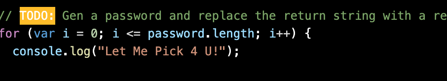
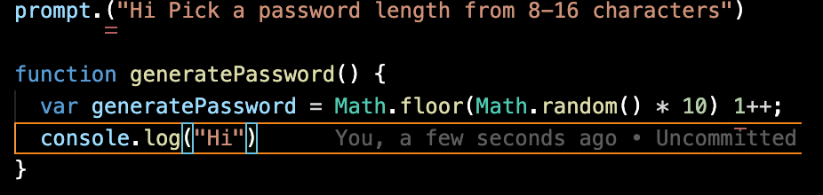

# hw-03-password## Acceptance 

## Employee Criteria

```
GIVEN I need a new, secure password
WHEN I click the button to generate a password
THEN I am presented with a series of prompts for password criteria
WHEN prompted for password criteria
THEN I select which criteria to include in the password
WHEN prompted for the length of the password
THEN I choose a length of at least 8 characters and no more than 128 characters
WHEN prompted for character types to include in the password
THEN I choose lowercase, uppercase, numeric, and/or special characters
WHEN I answer each prompt
THEN my input should be validated and at least one character type should be selected
WHEN all prompts are answered
THEN a password is generated that matches the selected criteria
WHEN the password is generated
THEN the password is either displayed in an alert or written to the page
```

Javascript was new for me but so. Sound crazy but i do.


Here is where i started my for Loop.

It's a start. I work slow and clean so no worry.

I know this is a waste of your time but this is where i am stuck. But I know its simple.



SMH... Im still going... So this is where i been stuck for a second...
