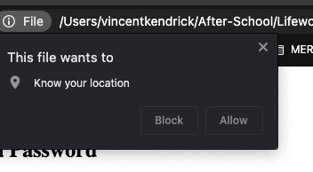
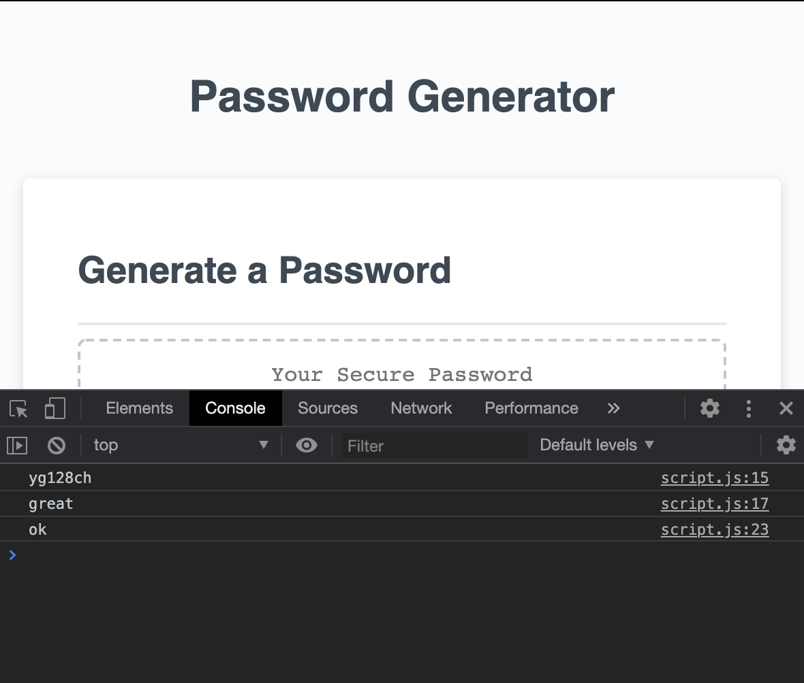
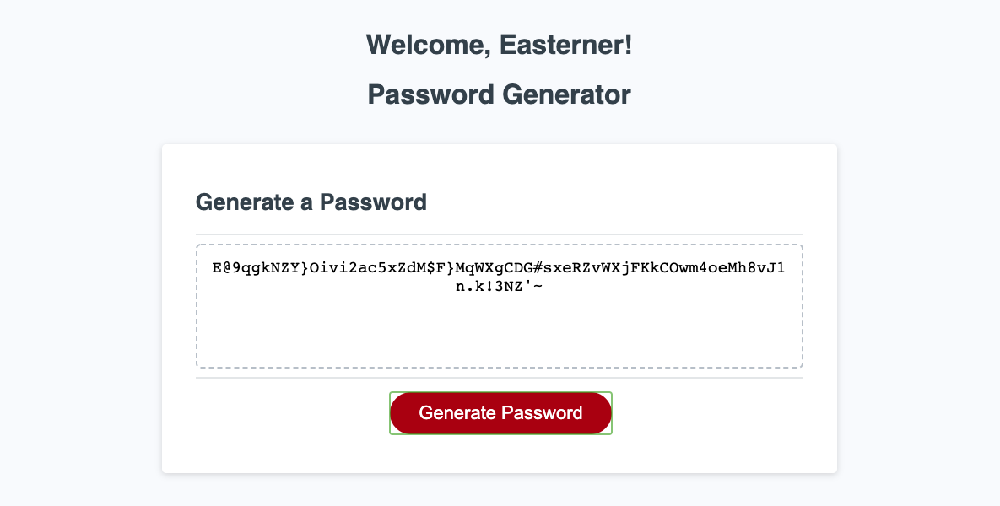
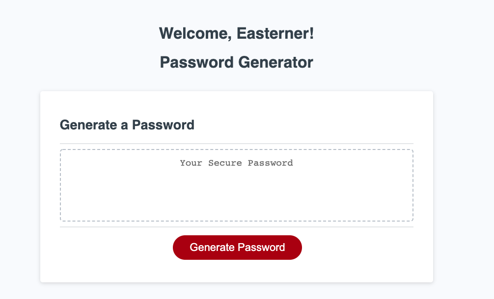

# JS-Password-Generator-gt

[](https://www.javascript.com/)

https://dagreatcode.github.io/JS-Password-Generator-gt/

## Acceptance Criteria

```
GIVEN I need a new, secure password
WHEN I click the button to generate a password
THEN I am presented with a series of prompts for password criteria
WHEN prompted for password criteria
THEN I select which criteria to include in the password
WHEN prompted for the length of the password
THEN I choose a length of at least 8 characters and no more than 128 characters
WHEN prompted for character types to include in the password
THEN I choose lowercase, uppercase, numeric, and/or special characters
WHEN I answer each prompt
THEN my input should be validated and at least one character type should be selected
WHEN all prompts are answered
THEN a password is generated that matches the selected criteria
WHEN the password is generated
THEN the password is either displayed in an alert or written to the page
```
This assignment shows me a lot about JS.

## Table of Contents

* [Usage](#usage)
* [Description ](#description)
* [Credits](#credits)
* [License](#license)

## Description 

Here is where i started my for Loop.

It took me a minute to get the for loop down pack. 
</br></br></br></br>


Math.floor is really useful. 
</br></br></br></br>


This is where I give the choice of length for the password.
</br></br></br></br>



I also added a GEO locate with this project. It can tell if you are located on the west or eastern side and will show that page for that location.
</br></br></br></br>


So this is where I been stuck again for a second...

</br></br></br></br>


I also added a GEO locate with this project. It can tell if you are located on the west or eastern side and will show that page for that location.
</br></br></br></br>

<!-- If you're new to Markdown, read the GitHub guide on [Mastering Markdown](https://guides.github.com/features/mastering-markdown/).

If you need an example of a good README, check out [the VSCode repository](https://github.com/microsoft/vscode). -->

## Usage 

Geo location 

</br></br></br></br>


## Credits

Vincent Kendrick dagreatcode@gmail.com


## License

MIT License

Copyright (c) [2020] [Vincent Kendrick]

Permission is hereby granted, free of charge, to any person obtaining a copy
of this software and associated documentation files (the "Software"), to deal
in the Software without restriction, including without limitation the rights
to use, copy, modify, merge, publish, distribute, sublicense, and/or sell
copies of the Software, and to permit persons to whom the Software is
furnished to do so, subject to the following conditions:

The above copyright notice and this permission notice shall be included in all
copies or substantial portions of the Software.

THE SOFTWARE IS PROVIDED "AS IS", WITHOUT WARRANTY OF ANY KIND, EXPRESS OR
IMPLIED, INCLUDING BUT NOT LIMITED TO THE WARRANTIES OF MERCHANTABILITY,
FITNESS FOR A PARTICULAR PURPOSE AND NONINFRINGEMENT. IN NO EVENT SHALL THE
AUTHORS OR COPYRIGHT HOLDERS BE LIABLE FOR ANY CLAIM, DAMAGES OR OTHER
LIABILITY, WHETHER IN AN ACTION OF CONTRACT, TORT OR OTHERWISE, ARISING FROM,
OUT OF OR IN CONNECTION WITH THE SOFTWARE OR THE USE OR OTHER DEALINGS IN THE
SOFTWARE.
 <!-- [https://choosealicense.com/](https://choosealicense.com/) -->


---
## Badges

🏆


<!-- Badges aren't _necessary_, per se, but they demonstrate street cred. Badges let other developers know that you know what you're doing. Check out the badges hosted by [shields.io](https://shields.io/). You may not understand what they all represent now, but you will in time. -->


## Contributing

Please let me know ahead of time. Thanks.
<!-- If you created an application or package and would like other developers to contribute it, you will want to add guidelines for how to do so. The [Contributor Covenant](https://www.contributor-covenant.org/) is an industry standard, but you can always write your own. -->

---
© 2020 Vincent Kendrick All Rights Reserved.

